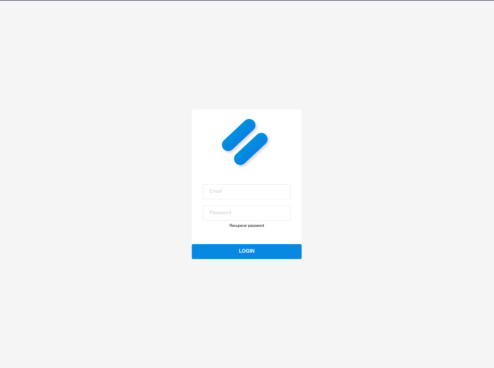

# SplitBook 



## Getting Started

### Development

Install [Docker](https://docs.docker.com/get-docker/) and **Docker Compose**.

```bash
git clone https://github.com/SplitBook/splitbook-backend.git
cd ./splitbook-backend
yarn # Install dependencies
cp .env.example .env # Fill environment variables
docker-compose up # Run instances (API / PostgreSQL / Redis)
```
